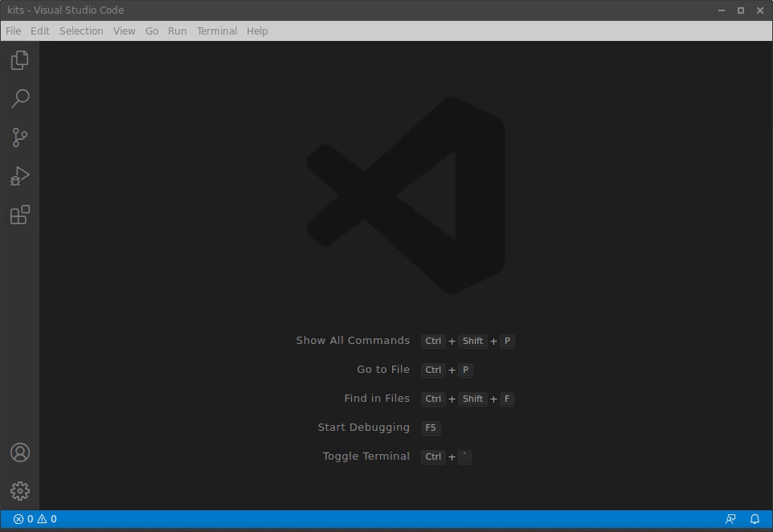
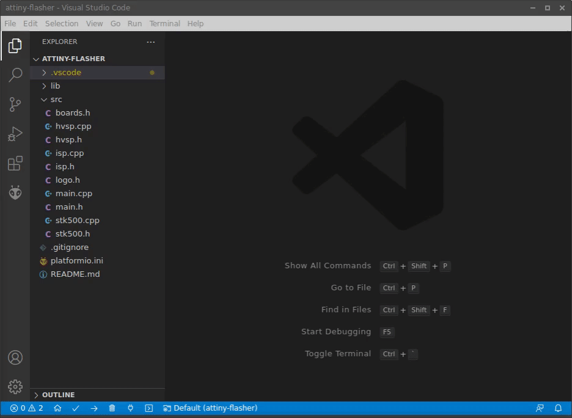
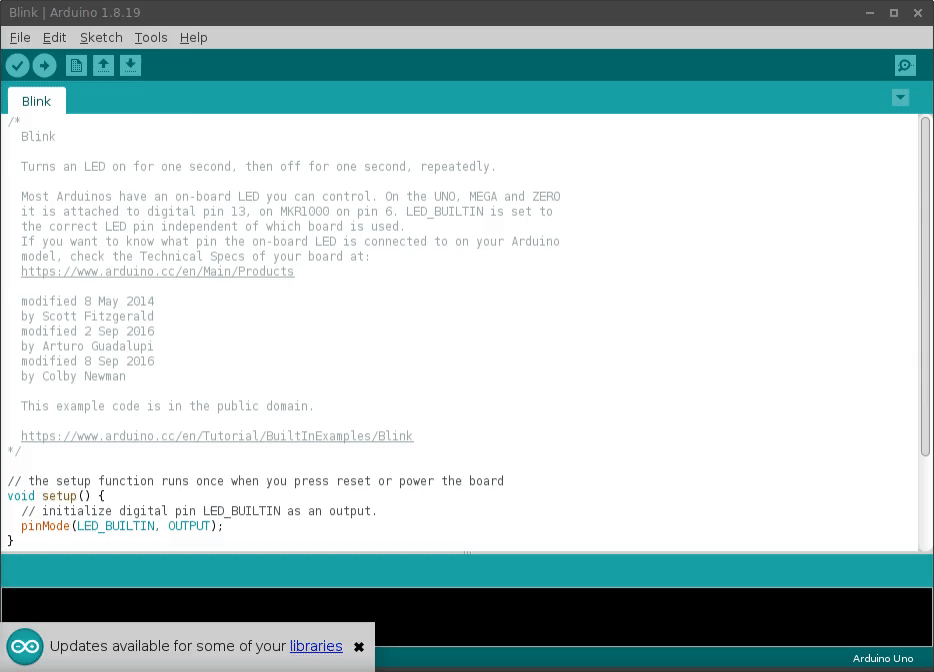
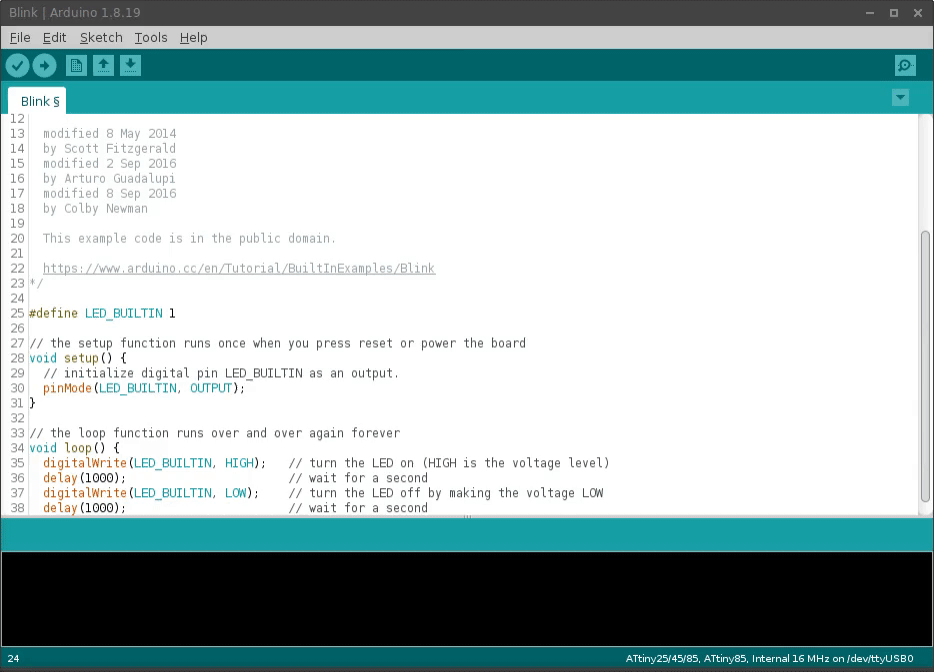

# ATtiny Flasher firmware


## Introduction

All repos are [Platformio](https://platformio.org/) projects, all tested under Ubuntu 20.04 LTS. 

Most of the repos will utilize multiple environments with different settings for different board revisions. Please refer to **platformio.ini** file within project folder.

For each project please find detailed description using links below

## ATtiny Flasher repos

- [attiny-flasher](/firmware/flasher/attiny-flasher) - main ATtiny Flasher firmware repo
- (WIP) [attiny-flasher-updi](/firmware/flasher/attiny-flasher-updi) - adaptation of [jtag2updi](https://github.com/ElTangas/jtag2updi) repo that can be used with Flasher to programm UPDI enabled MCUs
- (WIP) [attiny-flasher-tpi](/firmware/flasher/attiny-flasher-tpi) - TPI communication testing, requires soldering 0-Ohm resistor to be enabled on tyhe hardware level
- (DEBUGGING) [attiny-flasher-arduino-isp](/firmware/flasher/attiny-flasher-arduino-isp) - Original [ArduinoISP](https://www.arduino.cc/en/Tutorial/BuiltInExamples/ArduinoISP) repo adopted to be used with ATtiny Flasher
- (DEBUGGING) [attiny-flasher-test-reset-states](/firmware/flasher/attiny-flasher-test-reset-states) - Firmware that cycle through RESET modes (for HW testing and debuging)
- (DEBUGGING) [attiny-flasher-test-reset-fuses](/firmware/flasher/attiny-flasher-test-reset-fuses) - Firmware that clears out fuse settings on RESET-disabled Tinys (for HWSP testing and debuging)
- (DEBUGGING) [attiny-serial-demo](/firmware/flasher/attiny-serial-demo) - Demo formware for TARGET MCUs that blinks all available LEDs and sends out Serial communications (for HW testing and debuging) 
- (DEBUGGING) [attiny-serial-demo-naked](/firmware/flasher/attiny-serial-demo-naked) - same as above but Framework-less

## ATtiny Flasher Kits repos

- [attiny-bme280-vs-oled](/firmware/kits/attiny-bme280-vs-oled) - Demo firmware that reads BME280 sensor data and sends it to TINY-connected OLED screen
- [attiny-ir-messenger-send-receive](/firmware/kits/attiny-ir-messenger-send-receive) - Receive and send back IR communications (IR Messenger project Kit)
- [attiny-ir-messenger-send](/firmware/kits/attiny-ir-messenger-send) - Send IR communications (IR Messenger project Kit)
- [attiny-led-matrix-demo](/firmware/kits/attiny-led-matrix) - Demo of LED Matrix (Digital Clock kit)
- [attiny-led-matrix-game-of-life](/firmware/kits/attiny-led-matrix-game-of-life) - Demo of LED Matrix [game of life](https://en.wikipedia.org/wiki/Conway%27s_Game_of_Life) (Digital Clock kit)
- [attiny-led-matrix-rtc-clock](/firmware/kits/attiny-led-matrix-rtc-clock) - RTC clock demo firmware (Digital Clock kit)
- [attiny-led-matrix-rtc-clock-set](/firmware/kits/attiny-led-matrix-rtc-clock-set) - 'Set the time' firmware (Digital Clock kit)
- [attiny-led-matrix-text](/firmware/kits/attiny-led-matrix-text) - Demo of the text mode (Digital Clock kit)
- [attiny-rainbow-led](/firmware/kits/attiny-rainbow-led) - Demo firmware of different RGB LED modes (Rainbow Led project kit)
- [attiny-rainbow-led-demo](/firmware/kits/attiny-rainbow-led-demo) - Spinning rainbow demo (Rainbow Led project kit)
- [attiny-rainbow-led-light](/firmware/kits/attiny-rainbow-led-light) - Lightweight library sample that works with Tiny13 (Rainbow Led project kit)
- [attiny-rubber-ducky-keyboard](/firmware/kits/attiny-rubber-ducky-keyboard) - Keyboard emulator demo (Rubber Ducky project kit)
- [attiny-rubber-ducky-mouse](/firmware/kits/attiny-rubber-ducky-mouse) - Mouse emulator demo  (Rubber Ducky project kit)
- [attiny-traffic-light](/firmware/kits/attiny-traffic-light) - Traffic light demo firmware (Traffic Light project kit)

## How to flash

### Recomended: Using Platformio

All firmware files in this repo are [Platformio](https://platformio.org/) projects. This is a preferred tool to be used together with ATtiny Flasher, since it generally hadles better than our beloved Arduino IDE
- It doesn't require manual installation of new boards, it is enough to mention your board in the project configuration and Platformio will pull full framework automatically
- Same goes for the required libraries, just list your dependencies in the project config, Platformio will pull the latest versions
- It is a grown-up code editor, with the possibilities to look up for library sources and adding multiple source files to your project to create good structure.
- It allows to fine-tune build and upload settings as well as many more parameters.

To install Platformio simply add an extension to VS Code



#### Flashing Kits using Platformio

Simply open project in the Platformio IDE and run `Platformio: Build` and `Platformio: Upload` tasks. All the relevant settings can be found in `platformio.ini` file in the project folder.


#### Using Platformio to update Flasher firmware

Open [attiny-flasher](/firmware/flasher/attiny-flasher) folder in Platformio IDE. Find in the Platformio panel your revision of the board (Single letter, usually G, H, J etc is printed in the back side of the PCB). Use the physical switch on the Flasher to select self-programming mode.


Run `Upload` task.



### Using Arduino IDE

All Flasher Kits are built on ATTINY85 MCU which is not supported by default in Arduino IDE. Therefore first you need to add ATTINY85 support to your Arduino IDe using board manager. Use this link json configuration
```
https://raw.githubusercontent.com/damellis/attiny/ide-1.6.x-boards-manager/package_damellis_attiny_index.json
```



#### Flasher Configuration

By default ATTiny Flasher would expect 115200 baudrate when programming Flasher Projects. Arduino IDE in turn uses 19200 baud rate for the same. This can be fixed by modifying Arduino IDE internal configs (which is not recomended) or by flashing Flasher with updated baud rate


After this is done you may use `Arduino as ISP` programmer in the Arduino IDE with no modifications.



### Using avrdude

If you prefer to flash Kits usging pure console, you can use `avrdude` with the proper configuration (similar to what Platformio does under the hood)

Assuming you have built `firmware.hex` and your upload port to be `/dev/ttyUSB0`
```
avrdude -P/dev/ttyUSB0 -b115200 -v -p attiny85 -c stk500v1 -b 115200 -e -D -U flash:w:firmware.hex:i
```

## Links

- [Crowd Supply campaign](https://www.crowdsupply.com/sonocotta/attiny-flasher)
- [ATtiny Flasher - Product site](https://sonocotta.com/attiny-flasher/)
- [ATtiny Flasher Kit - Product site](https://sonocotta.com/attiny-flasher-kit/)
